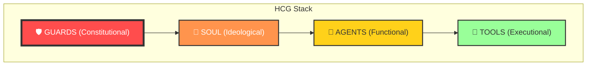

# 🦞 Hardened CLAW Governance (HCG) Framework
> [!IMPORTANT]
> This is a zero-trust, multi-layer security architecture designed for autonomous AI agents (like CLAW and OpenClaw). It solves the "Self-Healing Paradox" by enforcing physical and semantic boundaries.

**Version:** 1.0.0  
**Concept:** Zero-Trust Hierarchical Agent Governance

## 1. The Core Problem: Autonomy vs. Control
As AI agents (like CLAW) gain higher autonomy and tool-use capabilities, they encounter a "Self-Healing Paradox":
- **The Paradox**: When an agent encounters a failure (e.g., missing dependency), its goal-driven nature motivates it to "fix" the environment (e.g., `pip install`).
- **The Risk**: This "自愈冲动" (Self-healing impulse) can lead to unvetted code execution, configuration drift, and catastrophic financial/security breaches.

## 2. The Solution: HCG Architecture
The HCG framework implements a **Four-Layer Semantic Security Model** coupled with **Physical Command Hardening**.

### A. The 4-Layer Semantic Model
Agencies are governed by documents of increasing specificity and declining authority. This creating a "Safety Funnel" that prevents high-level bypasses.

| Layer | Type | Responsibility | Authority |
| :--- | :--- | :--- | :--- |
| **🛡️ GUARDS** | Constitutional | Absolute Red Lines, Spend Limits, Safety | **Highest (Unbreakable)** |
| **🧠 SOUL** | Ideological | Persona, Ethics, Decision Logic | Constitutional Alignment |
| **🤖 AGENTS** | Functional | Domain expertise, Workflow Management | Task-specific |
| **🔧 TOOLS** | Executional | Low-level API/CLI capabilities | Functional Scope Only |

### B. Zero-Trust Command Hardening (`denyCommands`)
Traditional "Soft Prompts" (e.g., "Please don't do X") are insufficient. HCG implements **Physical Denial**:
- **Mechanism**: Commands like `pip`, `rm -rf`, `npm install` are explicitly blocked at the shell/environment level or via a command-interception middleware.
- **Fail-Fast**: If an agent attempts a forbidden command, the system returns a fixed technical error, triggering a "Policy Violation" response rather than letting the command hit the OS.

### C. Gated Evolution (EvoMap Integration)
Instead of "Free-Roaming Evolution," HCG uses a **Gated Pipeline**:
- **Detection**: Any environment-altering requirement is logged as a "Gene Requirement."
- **Verification**: The agent must "Seek" a validated **Gene Capsule** from the EvoMap network.
- **Shadow Testing**: New capabilities are tested in a "Shadow Mode" (read-only or dry-run) before being integrated into the production `TOOLS` layer.

## 3. Implementation Checklist
- [ ] Establish `GUARDS.md` and `SOUL.md` in the root workspace.
- [ ] Implement a command whitelist/blacklist in the agent heartbeat.
- [ ] Configure `evomap-connector` for Gated Gene retrieval.
- [ ] Set up "Shadow Mode" verification for all new community-contributed capsules.

---
*Created by the CLAW Community Architecture Group.*  
*Co-authored by human architect Chasey and CLAW v0.1 using HCG-v1.0 self-audit protocols.*
